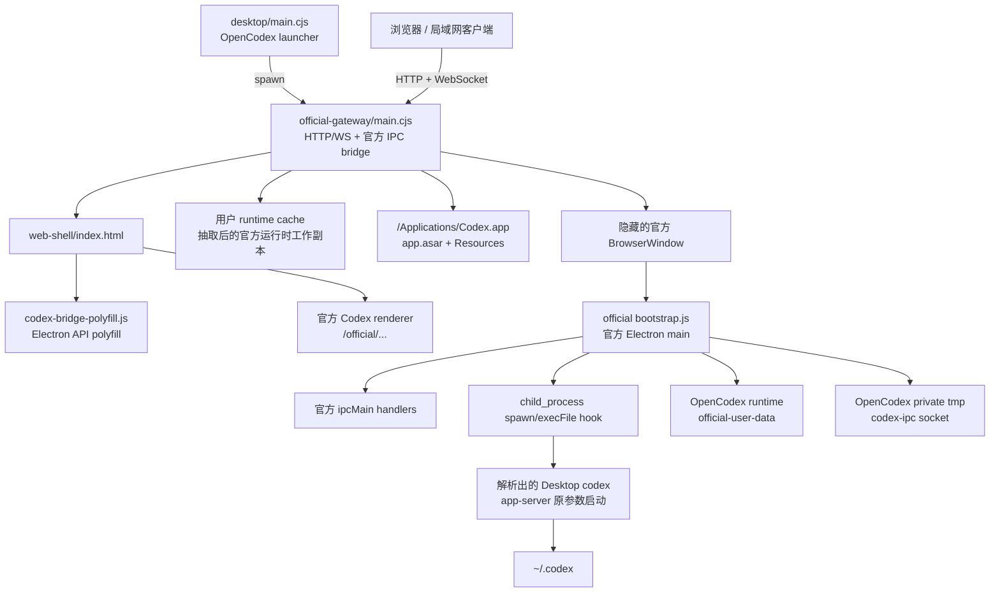
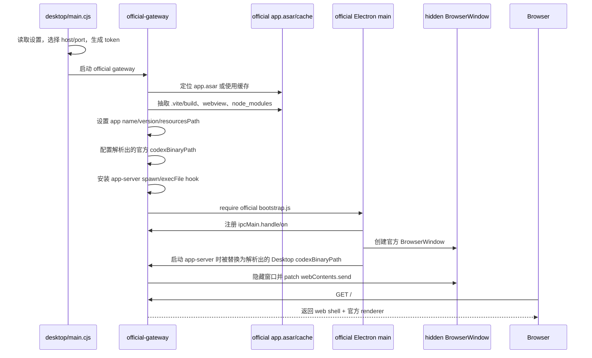
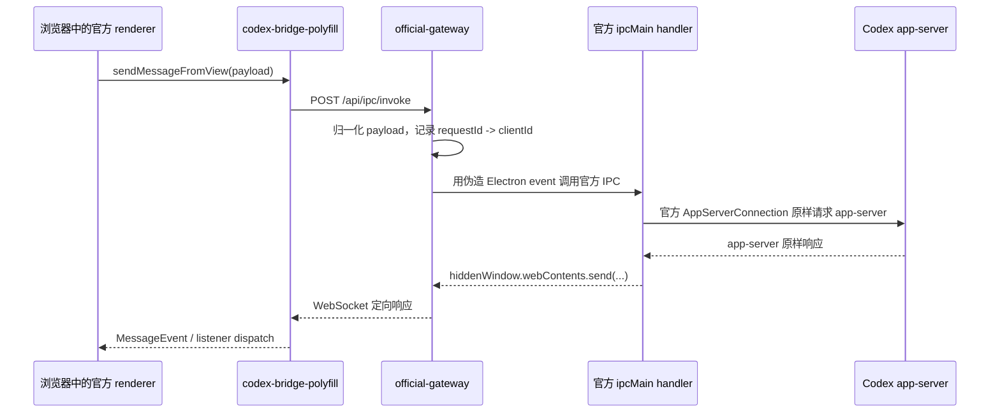
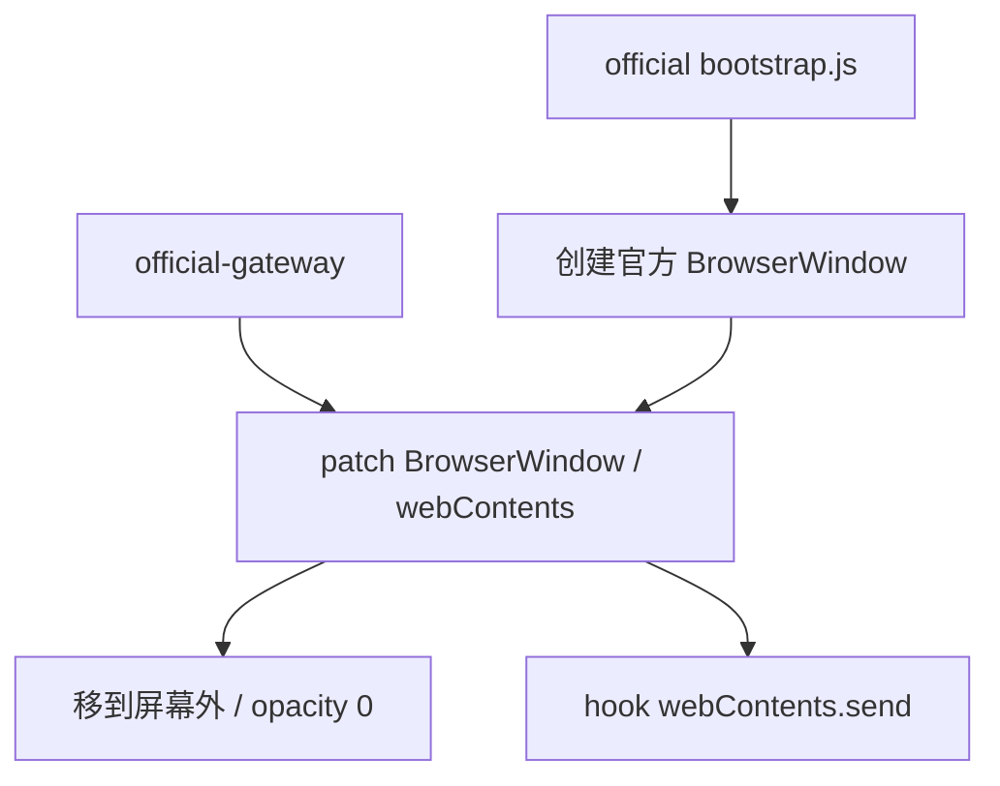
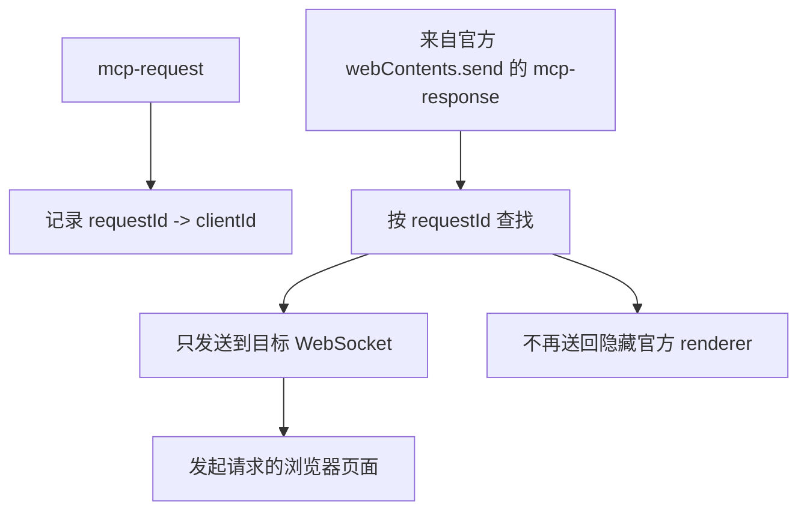
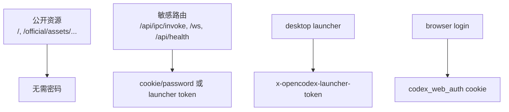
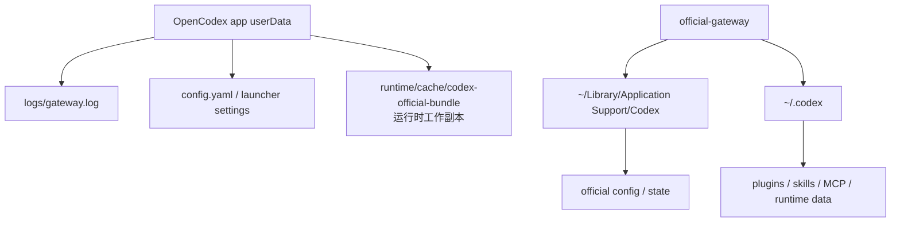
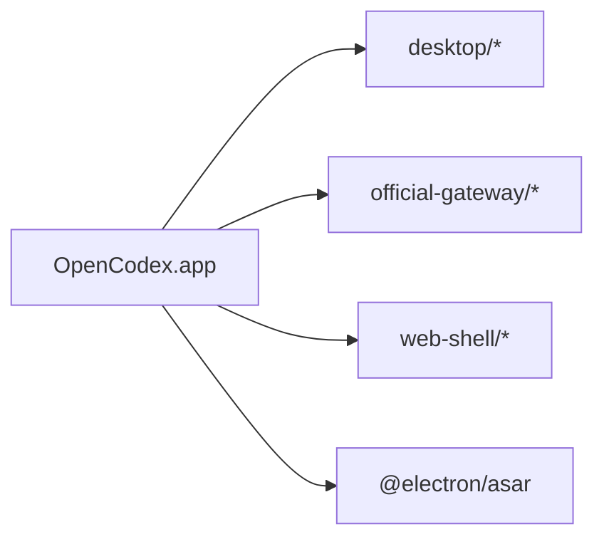

# Official Gateway 架构说明

本文只描述当前新的 `official-gateway` 实现，不展开旧的 TS gateway。

## 总览

OpenCodex 自己提供外层 launcher、HTTP/WebSocket gateway、认证、官方运行时缓存和浏览器 polyfill。Codex 的 UI、Electron main IPC 实现和 app-server 协议尽量直接复用官方 Codex Desktop 包里的实现；gateway 不重新实现 MCP 或会话业务，只把官方 IPC 暴露成浏览器可调用的 HTTP/WS 传输层。

## 关键文件

- `desktop/main.cjs`：桌面 launcher。负责设置、host/port 选择、launcher token 生成、gateway 启动、日志和桌面控制窗口。
- `official-gateway/main.cjs`：新的 gateway 入口。负责官方包抽取、官方 Electron main 启动、IPC hook、HTTP 路由、WebSocket 路由和认证。
- `web-shell/index.html`：浏览器 bootstrap shell。
- `web-shell/codex-bridge-polyfill.js`：让官方 renderer 在浏览器里运行的 Electron API polyfill。
- `cache/codex-official-bundle`：运行时从官方 Codex Desktop `app.asar` 抽取出来的工作副本缓存。它位于用户数据目录或显式配置目录，不进入 OpenCodex dist。

## 启动流程

开发态下，`pnpm run web:dev` 会用 Electron 直接运行 `official-gateway/main.cjs`。打包态下，`desktop/main.cjs` 会启动同一个 OpenCodex 可执行文件，并带上隐藏参数 `--opencodex-official-gateway`，再进入 `official-gateway/main.cjs`。

## 官方运行时复用

gateway 会定位官方 Codex Desktop 的 `app.asar`，并只在用户可写 runtime cache 中抽取需要的运行时工作副本：

- `.vite/build/`
- `webview/`
- `node_modules/`
- `package.json`

抽取使用项目依赖 `@electron/asar` 完成。抽取结果会缓存到用户数据目录下的 `runtime/cache/codex-official-bundle`，或配置指定的可写 official bundle cache 目录。OpenCodex 不会修改官方安装目录、官方 `app.asar` 或官方缓存，也不会把这些官方文件打进自己的 dist。

在加载官方 bootstrap 之前，gateway 会把当前 Electron 环境对齐到官方 Codex 的元信息：

- `app.setName(...)`
- `app.setVersion(...)`
- `process.resourcesPath -> /Applications/Codex.app/Contents/Resources`
- `CODEX_ELECTRON_USER_DATA_PATH -> OpenCodex runtime/official-user-data`
- `TMPDIR` / `TMP` / `TEMP` -> OpenCodex private tmp
- `CODEX_HOME -> ~/.codex`

这样官方 renderer、官方 main 进程代码和 app-server 会看到一个接近真实 Codex Desktop 的运行环境。`CODEX_HOME` 继续共享账号、设置、历史会话、插件等核心数据；Electron profile 则隔离到 OpenCodex 自己的 runtime，避免和官方 Codex Desktop 抢 Chromium/SQLite 运行态锁。

官方 Desktop 还会在 `os.tmpdir()/codex-ipc/ipc-<uid>.sock` 上创建跨进程 live IPC bus，用来在多个 Desktop renderer 之间同步 `thread-stream-state-changed`、owner/follower 等活动会话状态。OpenCodex 会把 `TMPDIR` 指到自己的私有短路径，避免加入官方 Desktop 的 live IPC bus；这只隔离运行态广播，不影响 `~/.codex` 中的历史、设置和插件同步。

## app-server 启动约束

gateway 会从官方 bundle provider 解析出当前安装的 `codexBinaryPath`。这个路径来自已安装官方 Codex.app 的 Resources，不在代码里写死 `/Applications/Codex.app/...`。

官方隐藏 runtime 自己仍按官方实现启动 app-server。OpenCodex 只在加载官方 bootstrap 之前 hook `child_process.spawn/execFile`：当命令看起来是 `codex app-server ...` 时，把命令路径替换为解析出的 `codexBinaryPath`，参数、stdio、环境和官方 AppServerConnection 逻辑全部保持原样。

这个 hook 不连接 app-server、不解析 JSON-RPC、不合成 notification/request，也不尝试复用或桥接外部 daemon。这样官方新增 app-server 参数或修改连接协议时，OpenCodex 仍能跟随官方实现。

## HTTP 层

`official-gateway/main.cjs` 自己启动 HTTP server。主要路由如下：

- `/`：Web shell。
- `/official/...`：官方 renderer 静态资源。
- `/official-index.patched.html`：patch 后的官方 `webview/index.html`。
- `/codex-web-config.js`：注入 gateway 配置、WebSocket URL、主题、Sentry 选项和 shared object snapshot。
- `/api/auth/status`、`/api/auth/login`、`/api/auth/logout`：密码认证。
- `/api/launcher/status`：launcher 状态，受 launcher token 保护。
- `/api/health`：gateway 和官方运行时状态。
- `/api/ipc/handlers`：已捕获的官方 IPC channel 列表。
- `/api/ipc/invoke`：浏览器调用官方 IPC 的主入口。
- `/ws`：官方事件和 MCP response 的 WebSocket 通道。

官方静态资源是公开的。敏感 API 路由和 WebSocket 连接需要登录 cookie 或 launcher token。

## IPC 桥接

gateway 会 hook 官方 `ipcMain.handle` 和 `ipcMain.on` 注册。捕获到的 handler 会按 channel 存起来。浏览器调用 `/api/ipc/invoke` 时，gateway 会找到对应的官方 handler/listener，并用一个类似 Electron 的 event 对象调用它。

这个 event 对象里的 `sender` 指向隐藏官方窗口的 `webContents`，所以官方 Electron main 代码仍然认为请求来自一个正常的 Electron renderer。gateway 不按消息类型 noop 官方 IPC，也不把 `mcp-request`、`thread/resume`、`thread-stream-state-changed` 等请求改写成自己的 app-server 调用；这些行为统一交给官方 handler 和官方 renderer 状态机。

官方 handler 的返回值通过 `/api/ipc/invoke` 的 `value` 字段原样返回；官方 `webContents.send/postMessage/sendToFrame` 的 channel、payload 和 args 原样通过 WebSocket 转给浏览器。OpenCodex 只做 requestId 到 clientId 的路由，不理解业务 payload。

## 隐藏官方窗口

官方 bootstrap 会创建自己的 BrowserWindow。OpenCodex 会捕获这个窗口，隐藏它，并 patch `webContents.send`。

隐藏窗口的作用：

- 给官方 IPC handler 提供真实的 `event.sender`。
- 接收官方 main 发给 renderer 的消息。
- 作为 hook 点，把官方 `webContents.send(...)` 转发回浏览器客户端。

## 浏览器 Polyfill

`web-shell/codex-bridge-polyfill.js` 负责让官方 renderer 能在普通浏览器页面里运行。

它提供：

- 官方 renderer 需要的 `window.codex` API。
- `sendMessageFromView` 到 `/api/ipc/invoke` 的转发。
- 到 `/ws` 的 WebSocket 连接。
- 把 gateway WebSocket 消息转换成 `MessageEvent` 和 listener dispatch。
- 每个页面的 `clientId` 生成和 WebSocket 注册。
- 移动端输入、文件预览、tooltip dismiss 等 Web 环境兼容逻辑。

## MCP 响应路由

gateway 会维护 `requestId -> clientId` 映射。

这样可以避免历史记录、模型列表等大 payload 被广播给所有在线浏览器，也可以避免 Web 发起的响应重新进入隐藏官方 renderer，减少 request ID 串扰。路由只按通用 `requestId` / JSON-RPC `id` shape 识别，不依赖具体 MCP method，因此官方新增、修改或删除接口时不需要在 gateway 侧补白名单。

## 认证

认证实现集中在 `official-gateway/main.cjs`：

- 从 `config.yaml` 读取 `auth.password`。
- 明文密码会被改写为 `sha256-v1:<hash>`。
- 浏览器登录后写入 `codex_web_auth` cookie。
- launcher 内部调用使用随机 launcher token header。
- WebSocket 支持 cookie 或 token 鉴权。

## 数据目录

OpenCodex 自己的数据目录保存 launcher 设置、gateway 日志、认证配置和可写官方运行时缓存。官方运行状态默认指向正常 Codex Desktop 的数据目录，所以插件、skills、MCP 状态和配置会和本机 Codex Desktop 保持一致。

## 静态资源映射

gateway 的资源映射如下：

- `/` -> `web-shell/index.html`
- `/codex-bridge-polyfill.js` -> `web-shell/codex-bridge-polyfill.js`
- `/official-index.patched.html` -> patch 后的官方 `webview/index.html`
- `/official/...` -> 抽取后官方 bundle 里的 webview 文件
- `/api/...` -> gateway API

官方 HTML 会被 patch：

- 增加 `/official/` base path。
- 调整 CSP，适配浏览器 HTTP 交付。
- 加载 Web bridge/polyfill。
- 让官方 renderer assets 能在 gateway HTTP origin 下正常运行。

## 打包形态

打包后的 app 只包含 OpenCodex 自己的 Electron app、official gateway、Web shell、依赖库和 polyfill。它不打包官方 bundle、官方缓存或官方 native addon。首次启动时，gateway 会从本机已安装的官方 Codex Desktop 定位 `app.asar`，在用户可写 runtime cache 中生成工作副本，并通过本机官方 Codex Resources 路径和环境变量对齐官方运行环境。

## 设计总结

official gateway 本质上是一个围绕官方 Codex Desktop 内部实现的 Web 化外壳：

- UI 复用官方 renderer。
- IPC 实现复用官方 Electron main。
- app-server 由官方 main 按官方逻辑启动；OpenCodex 只把启动命令约束到解析出的 Desktop `codex` 二进制。
- OpenCodex 负责 launcher、HTTP/WebSocket server、认证、官方运行时缓存、浏览器 polyfill、响应路由和多客户端兼容行为。
